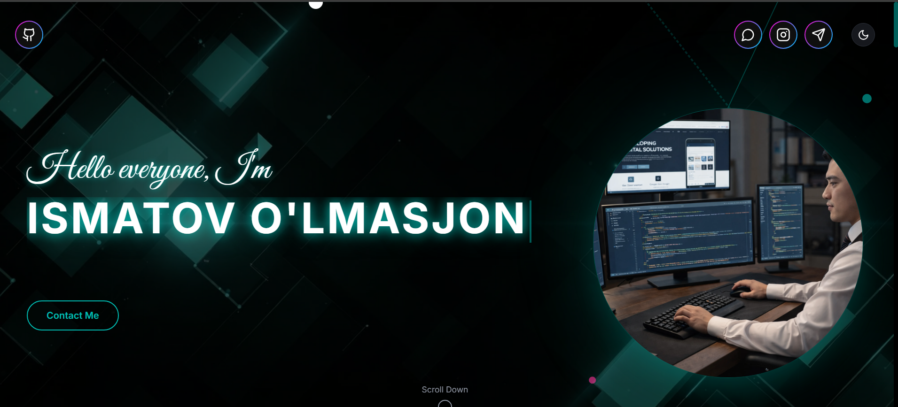

<p align="center">
  
</p>

<h1 align="center">💻 Ulmasjon — Developer Portfolio</h1>

<p align="center">
  Modern React & TypeScript portfolio website with cyber UI design and Telegram contact integration.
</p>

<p align="center">
  <a href="https://ulmasjon96.github.io/My-Portfolio/"><b>🌐 Live Demo</b></a>
</p>

---

## 👨‍💻 About Me

Hello! I'm **Ulmasjon**, a frontend developer passionate about building modern, interactive, and responsive web applications.

I enjoy working with React ecosystem, UI animations, and creating visually appealing interfaces.
This portfolio showcases my skills, projects, and provides a direct way to contact me.

---

## 🚀 Features

- ⚡ Modern Cyber / Neon UI Design
- 📱 Fully Responsive Layout
- 🎯 Smooth Scroll Animations
- 🧠 Skills Section with Icons
- 🖼 Projects Showcase
- 📨 Contact Form → Telegram Bot
- 🌙 Dark Theme
- ⚡ Fast Performance (Vite build)

---

## 🧰 Tech Stack

| Category   | Technologies            |
| ---------- | ----------------------- |
| Frontend   | React, TypeScript       |
| Styling    | Tailwind CSS, ShadCN UI |
| Build Tool | Vite                    |
| Deployment | GitHub Pages            |
| API        | Telegram Bot API        |

---

## 📂 Project Structure

```
My-Portfolio
│
├── index.html
├── assets/
├── preview.png
├── src/
│   ├── components/
│   ├── sections/
│   ├── pages/
│   └── main.tsx
│
├── public/
├── package.json
└── vite.config.ts
```

---

## 🛠 Run Locally

### 1. Clone repository

```bash
git clone https://github.com/ulmasjon96/My-Portfolio.git
```

### 2. Go to project folder

```bash
cd My-Portfolio
```

### 3. Install dependencies

```bash
npm install
```

### 4. Start development server

```bash
npm run dev
```

Open browser:

```
http://localhost:5173
```

---

## 📦 Production Build

```bash
npm run build
```

Build files will be generated inside the `dist` folder.

---

## 🌍 Deployment (GitHub Pages)

1. Run `npm run build`
2. Open `dist` folder
3. Copy all files inside it
4. Paste into repository root
5. Commit & push

---

## 📬 Contact

You can contact me directly from the website contact form.

Or via GitHub:

- GitHub: https://github.com/ulmasjon96
- Portfolio: https://ulmasjon96.github.io/My-Portfolio/

---

## ⭐ Support

If you like this project, please consider giving it a **star ⭐**.
It motivates me to create more useful and interesting projects!

---

## 📄 License

This project is open source and available under the **MIT License**.
